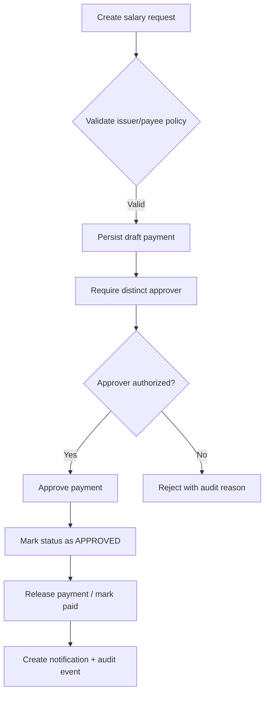
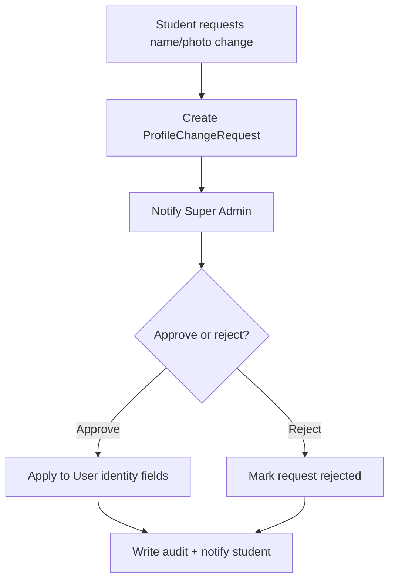

# Technical Specification: Role-Based Salary, Profile Identity, Cross-Module Access, and Audit Logging

## 1. Objective

This specification extends the current LMS architecture to support:

- peer-authorized salary issuance across financial and executive roles,
- self-service identity management for staff/guardians with request-based student profile updates,
- seamless cross-role module access without logout/login,
- comprehensive audit logging for operational and financial actions,
- finance-focused Excel exports for payroll, dues, fees, penalties, and expenses.

This proposal is grounded in the current codebase’s existing primitives:

- Prisma models: User, AuditLog, SalarySlip, SalarySlipEditLog, RoleAssumption, Notification
- RBAC: lib/rbac.ts
- Finance routes: app/api/accountant/salary-slips and app/api/salaries
- Existing UI: app/dashboard/accountant/salary-slips/page.tsx

> In the present schema, “Account Manager” maps to ACCOUNTANT and “Coordinator” maps to ADMIN. If a dedicated COORDINATOR role is required later, it can be introduced as a new enum value without breaking the current model.

---

## 2. Recommended Authorization Model for Salary Issuance

### 2.1 Design goals

The salary workflow must:

- prevent self-authorization,
- allow peer authorization between SUPER_ADMIN and ACCOUNTANT roles,
- support multiple SUPER_ADMIN users,
- keep approvals auditable and immutable,
- avoid circular logic.

### 2.2 Recommended pattern: Dual-control peer authorization

Use a two-step financial release pattern:

1. Create a salary payment request (draft or pending).
2. Require an approval from a distinct, authorized user.
3. Release the payment only after approval and all validations pass.

### 2.3 Approval policy

Use a policy table rather than hard-coded if/else rules.

| Payee role | Allowed issuer roles | Required approver roles | Notes |
|---|---|---|---|
| SUPER_ADMIN | ACCOUNTANT, SUPER_ADMIN | SUPER_ADMIN (distinct user) | Prevents self-approval; supports multiple Super Admins |
| ACCOUNTANT | SUPER_ADMIN, ACCOUNTANT | ACCOUNTANT (distinct user) | Finance peer approval |
| ADMIN | SUPER_ADMIN, ACCOUNTANT | SUPER_ADMIN or ACCOUNTANT | Keeps executive/finance control |
| TEACHER | ACCOUNTANT, ADMIN, SUPER_ADMIN | ACCOUNTANT or ADMIN | Existing salary-slip workflow remains compatible |

### 2.4 Business rule

- The issuer and approver must be different users.
- The approver must have an authorization role permitted for the target payee.
- A self-approval attempt is rejected at the API layer.
- If a user is impersonating a different role through the role-switch overlay, the system logs the effective role used for the action.

### 2.5 Payment flow



### 2.6 Edge cases to resolve

- Legacy salary slips created before this feature should be marked LEGACY and not treated as unauthorized.
- Salary slips for the same employee/month must remain unique unless a replacement is explicitly allowed.
- Currency, timezone, and payment reference numbers must be stored consistently.
- If a user has multiple active roles, the system must record which role was used for the action rather than infer it from the primary role.
- Concurrent approvals must be prevented with a unique lock or optimistic concurrency strategy.

---

## 3. Profile Identity Model

### 3.1 Requirement summary

- Super Admins, Account Managers, and Guardians can self-manage profile picture and display name.
- Students cannot self-update directly; they submit a request to a Super Admin.
- Identity must appear consistently in announcements, notifications, messages, and authored communications.

### 3.2 Recommended data model

#### Extend the shared identity surface on User

Add shared identity fields to User for consistent rendering across the platform:

```prisma
model User {
  id                   String  @id @default(cuid())
  displayName          String?
  profilePictureUrl    String?
  profilePicturePublicId String?
  profileStatus        String   @default("ACTIVE") // ACTIVE | PENDING_REVIEW | REJECTED
  profileUpdatedAt     DateTime?
  profileSource        String   @default("SYSTEM") // SYSTEM | SELF | APPROVED_REQUEST
  ...
}
```

#### Add request-based student profile change workflow

```prisma
model ProfileChangeRequest {
  id              String   @id @default(cuid())
  userId          String
  requestedById   String
  requestedField  String   // displayName | profilePicture
  proposedValue   String?
  currentValue    String?
  reason          String?
  status          String   @default("PENDING") // PENDING | APPROVED | REJECTED
  reviewedById    String?
  reviewedAt      DateTime?
  reviewerNote    String?
  createdAt       DateTime @default(now())
  updatedAt       DateTime @updatedAt

  user        User @relation(fields: [userId], references: [id], onDelete: Cascade)
  requestedBy User @relation(fields: [requestedById], references: [id])
  reviewedBy  User? @relation(fields: [reviewedById], references: [id])
}
```

### 3.3 Identity resolution rule

Every notification, announcement, and outbound communication should render identity using a single resolver:

1. Prefer User.displayName + User.profilePictureUrl.
2. If not present, fall back to the role-specific profile table (Teacher/Admin/Student/Guardian).
3. If still absent, fall back to the email-local-part.

This removes drift between dashboards, announcements, and messages.

### 3.4 Student update workflow



---

## 4. Cross-Role Access and Operational Logging

### 4.1 Requirement summary

Super Admins should be able to operate Account Manager modules without re-authentication, while the system records the exact role used for each action.

### 4.2 Recommended implementation: role overlay session context

Do not mutate the user’s primary role during the session. Instead, add an effective role context:

- primaryRole: the user’s canonical role from the auth account,
- effectiveRole: the role currently being used for the interface and access checks,
- availableRoles: the roles the user may temporarily operate under.

This keeps the current auth model intact and avoids breaking existing permission checks.

### 4.3 Operational logging model

Extend the existing AuditLog model or introduce a dedicated event log table.

Recommended fields:

```prisma
model OperationalLog {
  id              String   @id @default(cuid())
  actorId         String
  actorRole       String
  effectiveRole   String
  moduleName      String
  action          String
  entityType      String
  entityId        String?
  targetUserId    String?
  details         Json?
  timestamp       DateTime @default(now())
  ipAddress       String?
  userAgent       String?
  correlationId   String?

  @@index([actorId])
  @@index([moduleName, action])
  @@index([timestamp])
}
```

### 4.4 Display requirement

The dashboard should render a “Recent Activity Log” with this format:

`[User] [performed action] in [module] as [role] on [timestamp]`

Example:

- “Ayesha Khan approved a salary payment in salaries as SUPER_ADMIN on 2026-07-12 14:23:00”

### 4.5 Event coverage

Log every action for:

- module access,
- financial approvals,
- status updates,
- record edits,
- profile changes,
- export creation,
- role switching,
- role assumption creation/revocation.

---

## 5. Database Schema Changes

### 5.1 Existing tables to extend

1. User
   - add shared identity fields for display name and profile image,
   - add role-switch metadata if needed.

2. SalarySlip
   - add issuerId, approverId, approvalStatus, paymentReference, paymentDate, authorizationMode.

3. SalarySlipEditLog
   - add editedAsRole and correlationId.

4. AuditLog
   - add actorRole, effectiveRole, moduleName, action, targetUserId, metadata.

5. Notification
   - add senderId, senderName, senderAvatarUrl, relatedEntityType, relatedEntityId.

### 5.2 New tables

1. SalaryAuthorization
   - represents each financial approval event.

```prisma
model SalaryAuthorization {
  id              String   @id @default(cuid())
  salarySlipId    String
  issuerId        String
  approverId      String
  issuerRole      String
  approverRole    String
  status          String   @default("PENDING") // PENDING | APPROVED | REJECTED | VOIDED
  reason          String?
  createdAt       DateTime @default(now())
  updatedAt       DateTime @updatedAt

  salarySlip SalarySlip @relation(fields: [salarySlipId], references: [id], onDelete: Cascade)
}
```

2. ProfileChangeRequest
   - supports student identity update approvals.

3. OperationalLog
   - append-only event stream for cross-role actions and recent activity.

### 5.3 Migration strategy

- Use additive, non-destructive migrations first.
- Backfill existing records with safe defaults.
- Keep old salary slips readable and mark them as LEGACY_APPROVED if no explicit approval exists.
- Avoid dropping or renaming existing enum values.

---

## 6. Permission Matrix

### 6.1 Role map in this codebase

| Requested role | Current codebase role |
|---|---|
| Super Admin | SUPER_ADMIN |
| Account Manager | ACCOUNTANT |
| Coordinator | ADMIN |
| Guardian | GUARDIAN |
| Student | STUDENT |

### 6.2 Recommended permissions

| Role | Salary issuance | Salary approval | Profile self-update | Student profile requests | Cross-role module access | Export reports |
|---|---|---|---|---|---|---|
| SUPER_ADMIN | Yes, for staff and peer roles | Yes | Yes | Yes, approve/reject | Yes | Yes |
| ACCOUNTANT | Yes, for staff/payroll and peer roles | Yes, for peer finance/managerial payroll | Yes | No | Yes, as overlay | Yes |
| ADMIN | Limited payroll actions | Limited | Yes | No | Yes, as overlay if granted | Limited |
| GUARDIAN | No | No | Yes | No | No | No |
| STUDENT | No | No | No, request-based | Yes | No | No |

### 6.3 Recommended module access rules

- SUPER_ADMIN gets full access plus finance overlay access to ACCOUNTANT modules.
- ACCOUNTANT gets finance workflows plus overlay access to ADMIN/SUPER_ADMIN operational modules when explicitly allowed.
- ADMIN gets coordination workflows plus a limited operational overlay.
- GUARDIAN and STUDENT access remain narrowly scoped.

---

## 7. API and UI Components

### 7.1 New or extended APIs

- GET /api/profile/me
  - returns current user identity and avatar state.

- PATCH /api/profile/me
  - self-service update for SUPER_ADMIN / ACCOUNTANT / GUARDIAN.

- POST /api/profile/requests
  - student submits profile change request.

- PATCH /api/profile/requests/[id]
  - Super Admin approves/rejects the request.

- POST /api/salaries/authorize
  - creates salary authorization and validates peer policy.

- PATCH /api/salaries/[id]/approve
  - approves or rejects payment.

- POST /api/roles/switch
  - sets effective role context for overlay access.

- GET /api/activity-log
  - recent cross-role activity feed.

- GET /api/exports/salary-report
  - Excel export with category/date-range/recipient filters.

### 7.2 Functional UI components

- RoleOverlaySwitcher
- SalaryAuthorizationPanel
- ProfileIdentityCard
- ProfileChangeRequestList
- RecentActivityLogPanel
- FinanceExportToolbar

---

## 8. Reporting and Excel Export Requirements

### 8.1 Export dimensions

Exports should support:

- category: salary, staff dues, fees, penalties, expenses,
- date range,
- recipient or employee,
- summary totals and line items.

### 8.2 Output structure

Each Excel file should include:

1. Cover sheet with generated date, institution name, date range, and total.
2. Summary sheet with totals by category.
3. Detail sheet with row-level entries.
4. Optional approval sheet for salary records.

### 8.3 Professional formatting requirements

- bold headers,
- freeze panes,
- currency formatting,
- aligned date columns,
- distinct styles for totals and warnings,
- export naming pattern: `salary-report-2026-07.xlsx`.

---

## 9. Implementation Roadmap

### Phase 0 — Foundation (highest priority)

- add shared identity fields to User,
- extend AuditLog or add OperationalLog,
- add role-overlay session context,
- add migration and backfill strategy.

### Phase 1 — Salary workflow

- add SalaryAuthorization and approval-state fields,
- implement peer-policy validation,
- connect to current salary-slip routes,
- add notifications and audit entries.

### Phase 2 — Profile changes

- implement self-profile updates for administrators/guardians,
- implement student request workflow,
- enforce identity resolution across announcements/notifications/messages.

### Phase 3 — Cross-role operations

- expose role overlay in UI,
- log module access and actions,
- expose recent activity feed on dashboard.

### Phase 4 — Export and reporting

- build Excel export endpoints and UI,
- add summary and line-item formatting,
- support category/date-range/recipient filters.

---

## 10. Architectural Risks and Recommended Refinements

### 10.1 Key design concerns

1. Avoid changing primary role semantics.
   - Add effective-role context rather than replacing the user’s canonical role.

2. Keep authorization decisions explicit and policy-driven.
   - Do not hard-code logic in route handlers alone; centralize it in a service layer.

3. Prevent audit gaps.
   - Every financial and cross-role action must be emitted to the audit stream even if the UI fails later.

4. Do not rely on UI rendering alone for access control.
   - Backend enforcement is mandatory.

5. Preserve backward compatibility.
   - Existing salary slips, audit records, and notifications must remain readable.

### 10.2 Recommended refinements before development

- Introduce a single `ActorContext` service that supplies actorId, actorRole, effectiveRole, module, and correlationId.
- Centralize all permission checks in a service layer rather than scattered conditionals.
- Define a single identity-resolution helper so all UI surfaces render the same name/avatar.
- Add a status-state machine for salary payments (DRAFT → PENDING_APPROVAL → APPROVED → PAID → CANCELLED).
- Add a “legacy record” handling policy for old financial transactions that were created before explicit approvals.

---

## 11. Safe Production Rollout Plan

1. Deploy schema changes as additive migrations.
2. Keep old UI routes working while new endpoints are introduced.
3. Roll out logging first so the system captures all new actions immediately.
4. Enable salary authorization behind a feature flag.
5. Backfill historical records with safe defaults and mark them as legacy.
6. Monitor for permission regressions and audit noise in the first production cycle.

---

## 12. Summary Recommendation

The best production-safe approach is a hybrid model:

- use existing Prisma and audit infrastructure,
- add a dedicated authorization layer for salary approvals,
- introduce effective-role context for seamless cross-module operation,
- centralize identity resolution for profile data,
- and log every operational and financial action in an append-only event stream.

This gives the platform a scalable, auditable, and role-safe foundation for live production operations.
